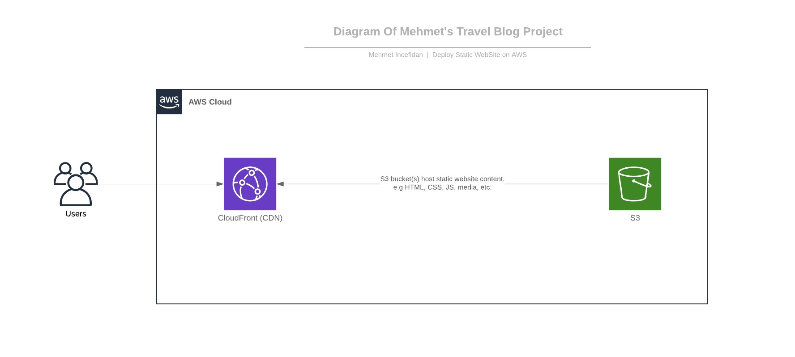

# Project 1 - Deploy Static Website on AWS 



```sh
In this project(Mehmet's Travel Blog), I deployed a static website to AWS using S3, CloudFront, and IAM.
```

## The files included are:

```sh
* /Images-of-Result-Deploy : Screenshot the results of each of my steps.
* /Web Site of Mehmet's Travel Blog : Files for the website.
* Policy.json : Bucket's policy.
```
